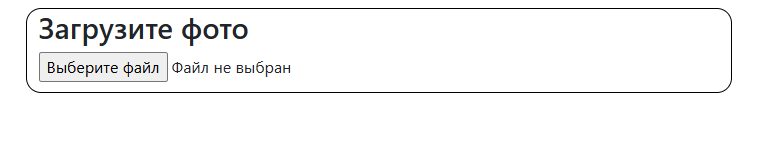
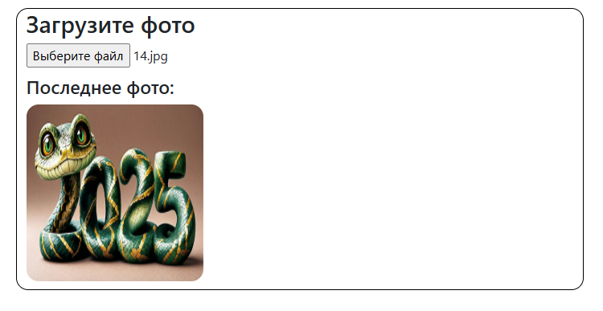
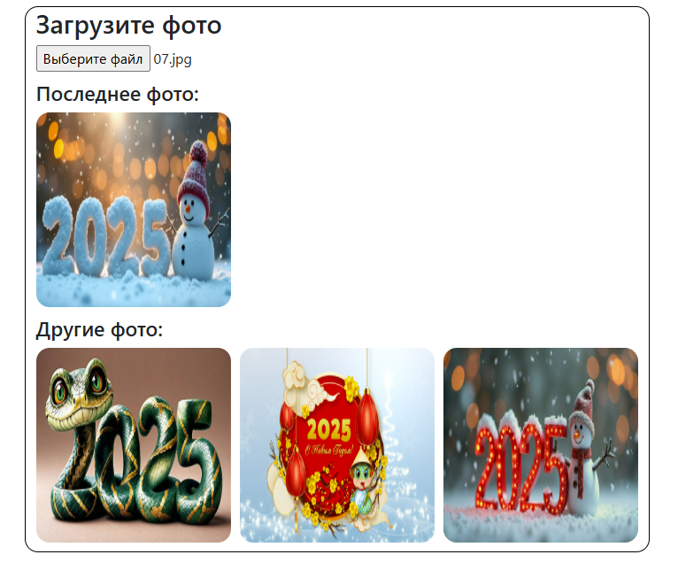

# View Profile Photo

Разрабатываем отображение фото профиля пользователя на базе Redux Toolkit.

## Инструкция к заданию

-  Пользователю дана возможность загрузить фото в профиль.

-  После загрузки фото отображается в размере 220px\*220px.
-  После загрузки изображения поле добавления фото не удаляется.
-  Можно загружать неограниченное количество изображений.

-  При загрузке следующего изображения сверху отображается последнее загруженное фото, остальные — снизу.
